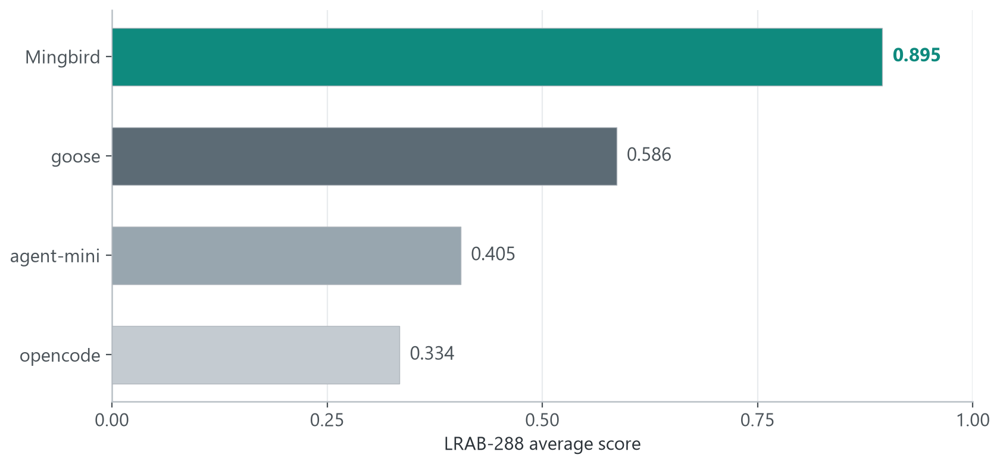

# 🐦 Mingbird

**Small local models on your laptop that actually finish the job — not just chat.**

Mingbird is a local-first agent harness for Windows + Ollama (experimental Linux build), designed for the models most people can actually run: **2–9B parameters on integrated graphics and 16–32 GB of RAM**. No cloud, no account, no telemetry (no outbound connections at all beyond the Ollama/search endpoints you explicitly configure); an integrated or entry-level discrete GPU is all it asks.

[中文版](README_zh.md) · Apache-2.0 · Windows 10/11 · Linux & macOS (experimental) · Offline-first


## The problem we set out to solve

Mainstream agent frameworks are designed for large cloud models. Feed them a 2B local model and everything from the demo videos falls apart: full-tool prefill blows the context, the model cannot self-correct, it loops on tool calls, or quietly gives up halfway through.

**Our position: these are harness defects, not model defects.** Small models usually "know what to do" — what they cannot do is reliably "emit and execute" it. Mingbird is the harness that fills exactly that gap — the same model that only chats elsewhere starts getting work done here.

## What it can do

- **Real tasks**: write code and run the tests, organize files, web research, analyze data, call MCP tools.
- **Streaming output + visible thinking** — watch it reason, then the thinking folds away and the answer flows.
- **Voice input out of the box** — the installer bundles a local STT model (pure CPU, ~20× real time) that stops automatically when you stop talking.
- **Task time-box (off by default)** — type `40` / `1.5h` / `half an hour` into the box, or write "限时 40分钟" right in the task description (auto-detected, highest priority); the harness steers the run to wind down as the deadline approaches. Local-model users care about wall-clock time — deadlines are a first-class setting.
- **Session memory** — history persists locally; searchable and replayable.
- **Model auto-detection** — whatever you pulled in Ollama is what you use, up to 256K context.
- **Skills & MCP** — markdown skills load on demand; MCP servers are plain JSON config.
- Bilingual UI (English / 中文).
- **Web UI (experimental)** — the same agent in your browser, local-only
  ([guide](docs/webui.md)).
- **One-click installer**, or run from source.

## What makes it different

Every mechanism comes from "small models can't do X, so the harness does it for them":

| Small models can't… | Mingbird does it for them |
|---|---|
| …self-debug | the harness runs the tests itself and feeds back exact failures (`file:line` + the original error text) |
| …edit code safely | every change is auto-backed up (`.bak`); rollback is one command |
| …escape tool-demo loops | Q&A/task layering — chat answers once and stops; only real tasks unlock the full toolset |
| …fit all tools in context | flat prefill loads by category: factory prefill stays at ~774–851 tokens, and CI fails any change that grows it by a single byte |
| …stay on target in long tasks | delivery self-check gate: before claiming done, it re-reads the original task and verifies its work |

Zero hardcoding: Ollama address, executable, GPU environment variables, model aliases — all detected at runtime or configured in `~/.ollama_agent/config.json` (see [AGENTS.md](AGENTS.md)).

## Measured: same model, different harness

We built **LRAB**, our own benchmark: **4 harnesses (Mingbird / goose / agent-mini / opencode, all stock) × 4 open models (gemma4:e2b 2B, qwen3.5:4b 4B, gemma4:12b 12B, ornith-1.5:35b 35B MoE) × 18 real tasks = 288 cells**, same machine, same budgets (90 min workflow / 180 min long-horizon), deterministic scoring, timeouts score 0.




| Harness | gemma4:e2b (2B) | qwen3.5:4b (4B) | gemma4:12b (12B) | ornith-1.5:35b (35B MoE) | **overall** |
|---|---|---|---|---|---|
| **Mingbird** | **0.80** | **0.92** | **0.92** | **0.94** | **0.895** |
| goose | 0.27 | 0.64 | 0.62 | 0.82 | 0.586 |
| agent-mini | 0.25 | 0.71 | 0.58 | 0.09 | 0.405 |
| opencode | 0.02 | 0.40 | 0.14 | 0.78 | 0.334 |

What really matters is the pattern: **the smaller the model, the harder the other harnesses collapse** — and that is exactly the size people can run on their laptops. In this comparison Mingbird is the only harness that stays usable at 2B. Same models, same tasks; only the harness changed.

On an **external benchmark** (τ²-bench retail — the official 115-task suite, 114 tasks scored on both sides here, pass^1), the same local 4B model scores **0.746 with Mingbird vs 0.430 with the benchmark's native agent — swapping the harness alone is +73% end-to-end completion**:


\* The gpt-4o line (0.604) in the chart is a scale reference only (the official setup uses gpt-4o as the user simulator), not a direct comparison; both arms in our run use the same user simulator. Methodology, task lists, scoring code and every per-cell result: [benchmarks/](benchmarks/README.md). The same-model CLI-harness comparison (goose / opencode via MCP) is **running now**; the table in that file will be updated when it finishes.

## Hardware

Measured on real machines, not estimated:

| Tier | Hardware | Models | Experience |
|---|---|---|---|
| Entry | AMD 680M iGPU · 16 GB RAM | 2–4B | streaming, near raw-Ollama speed |
| Base | Intel Arc B390 iGPU · 32 GB RAM | 2–35B (MoE) | 35B long tasks run end-to-end |

An integrated GPU or an entry-level discrete GPU is enough; higher-end cards naturally work too. Mingbird does not wrap or proxy the model — its own static prefill stays under ~850 tokens.

## Getting started

Mingbird runs in **four ways** — same engine everywhere, pick what fits:

| You want | How |
|---|---|
| Windows desktop client | `Mingbird-v1.4.0-EN/CN-Setup.exe` from [Releases](../../releases) |
| Linux / macOS desktop client (experimental) | CI-built tarballs from Releases → `sh install-unix.sh` |
| From source (desktop GUI) | `pip install -r requirements.txt` → `python agent_gui.py` |
| **Web UI in your browser** (experimental) | `pip install -r requirements.txt` → `python webui/server.py` → open http://127.0.0.1:8765 — [guide](docs/webui.md) |

All of them share sessions, skills, MCP servers and settings.

1. Install [Ollama](https://ollama.com) and pull a model:
   ```
   ollama pull gemma4:e2b      # small and fast
   ollama pull qwen3.5:4b      # 4B, the benchmark workhorse
   ```
2. Grab `Mingbird-v1.4.0-EN-Setup.exe` from [Releases](../../releases), install → desktop shortcut.
3. Launch, pick a model, hand it work.

Linux & macOS (experimental, CI-built): download `mingbird-v1.4.0-linux-x64.tar.gz` or `mingbird-v1.4.0-macos-*.tar.gz` from Releases, extract, run `sh install-unix.sh`, launch `~/.local/share/Mingbird/LocalAgent`. Ollama must be installed on that machine.

From source: `python agent_gui.py` (GUI) or `python ollama_agent.py --help` (CLI). Python 3.12 recommended.

## Safety

> [!WARNING]
> Mingbird reads and writes files on your disk and runs commands. Choose a working directory with care.

Mechanisms, not slogans: working-directory boundary guard (normalized-path checks), sensitive-path gates (`.ssh`, `.env`, credentials), a GUI confirmation dialog for out-of-bounds actions, and parallel sub-agents denied by default.

## Honest limits

A 2B model will not rewrite your entire codebase in one shot — but it reliably handles the bulk of everyday agent work, and when it cannot, it fails loudly (rather than silently wrong). 35B on an iGPU works but is not fast. LRAB is a benchmark we designed ourselves — which is exactly why the tasks, the scoring code and the full transcripts are public: rerun it yourself instead of taking our word for it.

## License

Apache-2.0 — free to use, modify, and distribute.
