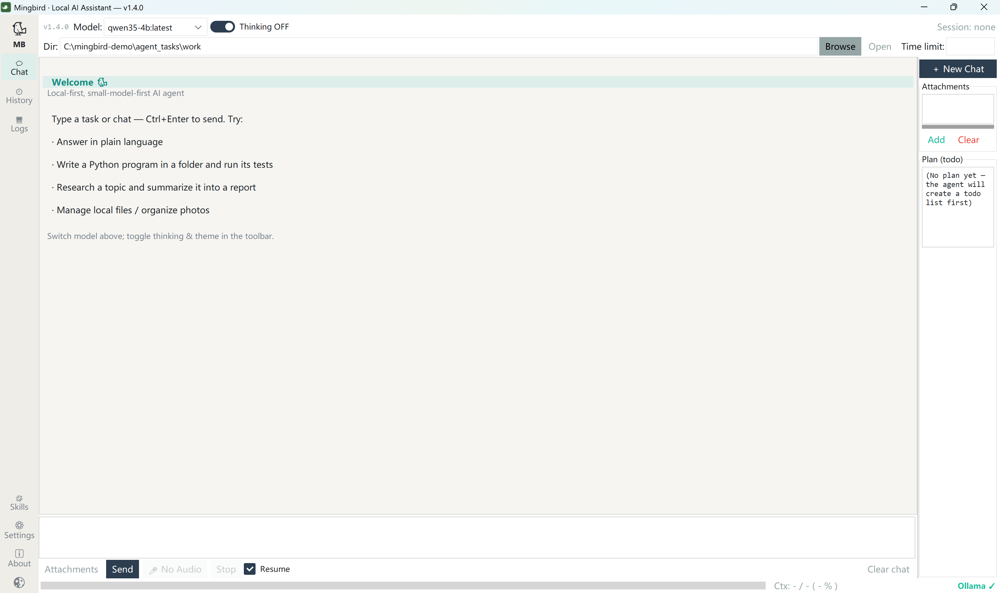
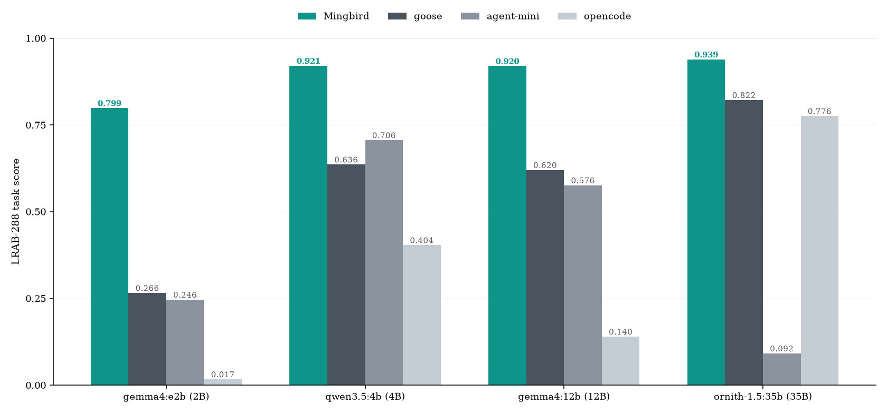

# 🐦 鸣鸟 Mingbird

**本地优先的 agent harness：在你手头这台笔记本上，让核显里的 2–9B 小模型把真实任务干完。**

[English](README.md) · Apache-2.0 · Windows 10/11 · Linux & macOS（实验版） · 离线优先

> **同一个 2B 模型：0.017 → 0.821。问题出在 harness。**
>
> 都说本地模型得配大独显。其实一台普通笔记本——核显、16–32 GB 内存——就够了：那些在云风格框架里跑不动的 2–9B 小模型，在这里能交付完整产物，因为你见过的那些失败是 harness 缺陷，不是模型缺陷。端到端实测，288 格数据全部公开。

当前版本 **v1.7.0** · 持续维护中（[CHANGELOG](CHANGELOG.md)）· CI 构建 Linux/macOS 产物 · 451 项测试



## 有什么不同

每个机制都源于"小模型做不到 X，所以 harness 替它做"：

| 小模型做不到… | 鸣鸟替它做 |
|---|---|
| …自我调试 | harness 亲自跑测试，回喂精确失败（`file:line` + 报错原文） |
| …无风险地改代码 | 每次改动自动备份（`.bak`），一条命令回滚 |
| …跳出工具演示循环 | 问答/任务分层（聊天答完即停）+ 签名级反循环梯队：纠正 → 硬复位 → 优雅退出 |
| …把工具塞进上下文 | 扁平 prefill 按类别装载：出厂 prefill 恰为 797 token，任何净增一个字节的改动都会让 CI 挂掉 |
| …一次输出整个大文件 | 单次调用输出上限 8192（原 2048）；仍被截断时改给"先写骨架、再追加"的分块反馈，不再陷入空转循环 |
| …停止爬行巨大文件 | 爬行守卫 v2 字节预算制（2× 文件大小，钳制在 64KB–512KB）——永不拒绝 |
| …长任务不跑偏 | 交付自查门禁：宣称完成前回读任务原文核对 |
| …抵住破坏性冲动 | 五环安全网兜住（见[安全](#安全)） |

没有任何东西是写死的：Ollama 地址、可执行文件、GPU 环境变量、模型别名，全部运行时识别或在 `~/.ollama_agent/config.json` 配置（见 [AGENTS.md](AGENTS.md)）。质量底线由 451 项回归测试守住，prefill 零增长断言也在其中。

## 我们要解决的问题

主流 agent 框架是为云上大模型设计的。喂给它一个 2B 本地模型，演示视频里的一切都会崩掉：全量工具 prefill 撑爆上下文、模型无法自我纠错、陷入工具调用死循环，或者半途悄无声息地放弃。**我们的主张：这些是 harness 的缺陷，不是模型的缺陷**——小模型经常知道该做什么，只是不能稳定地一步步做出来。

这不是我们一家的观察：近期的公开讨论指向同一结论——护栏优先的 harness 上了 HN 首页（"guardrails take an 8B model from 53% to 99%"）、"why your local LLM feels dumber than it is" 系列讨论、本地推理话题从"能不能跑"转向"能不能交付"。缺的是有人把 2–9B 这一档从头到尾做完。这就是本项目。

## 它能做什么

- **真实任务**：写代码并跑测试、整理文件、联网调研、分析数据、调用 MCP 工具。
- **流式输出 + 思考过程可见**——交付内容流式输出，思考过程随后自动折叠、进入正式回答。
- **拖入/粘贴即附件**——文件直接拖进聊天框，或 Ctrl+V 粘贴：剪贴板里的文件、截图瞬间成为附件，随指令一起发送。
- **语音输入开箱即用**——安装包内置本地 STT 小模型（纯 CPU，~20× 实时转写），说完自动停。
- **任务时限（默认关）**——输入框填 `40` / `1.5h` / `半小时`，或直接在任务描述里写"限时 40 分钟"（自动识别、优先级最高）；临近时限自动收尾提醒。本地模型用户在意墙钟时间。
- **会话记忆**——历史会话持久保存，可搜索、可回放。
- **模型自动识别**——Ollama 里拉什么就用什么，最高 256K 上下文。
- **技能 & MCP**——markdown 技能按需装载；MCP 服务器纯 JSON 配置。
- **中英双语**界面。
- **Web UI（实验版）**——同一个 agent 跑进浏览器：源码运行 `python webui/server.py`，打开 http://127.0.0.1:8765（仅绑定 127.0.0.1，数据不出本机）——[指南](docs/webui_zh.md)。
- **一键安装包**，也可源码运行。

## 实测：同一个模型，不同的 harness

4 个 harness × 4 个开源模型（2B–35B）× 18 个真实任务 = 288 格；同一台机器、确定性判分、逐格全公开。

| 基准 | 出品方 | 一句话结果 |
|---|---|---|
| LRAB-288 | 我们（自建） | 总分 0.886 vs goose 0.631 / opencode 0.479 / agent-mini 0.405 |
| τ²-bench 三域 | Sierra Research（外部） | retail 0.763 / airline 0.740 / telecom 1.000——三域第一或并列第一 |
| 消融（v1.5.0 代码） | 我们 | 去掉 finish_gate 代价最大：−0.098 |



- **2B 列就是故事**：0.821 vs 0.017–0.271——四家里唯一没有小模型断崖的，而 2B 正是核显笔记本从容跑得动的尺寸。2B 与 12B 档对三家竞品全部显著（Holm 校正 Wilcoxon）；不显著的地方（4B 对 goose、35B 对 opencode）我们也如实写明。
- 外部基准 τ² 上，telecom 近饱和（1.000 / 0.991 / 0.930）：该域任务族高度重复，鸣鸟 τ² 适配层披露的重复调用守卫恰好吸收这一失败模式。
- 思考开关本身就是 harness 层杠杆，竞品臂最大位移 +0.69——详见 [benchmarks/README.md](benchmarks/README.md)。

**完整表格、显著性检验与逐格原始数据全部公开**在 [benchmarks/](benchmarks/README.md)——含 288 格全量 CSV（[`lrab_scores.csv`](benchmarks/lrab_scores.csv)）与 τ² 逐题 manifest（[`tau2/`](benchmarks/tau2)）。单机 ~30 分钟即可复现任意一格：**[benchmarks/reproduce_one.md](benchmarks/reproduce_one.md)**。

## 硬件

真实机器实测，不是估算：

| 档位 | 硬件 | 模型范围 | 体验 |
|---|---|---|---|
| 入门 | 任意核显 · 16 GB 内存 | 2–4B | 流式近实时 |
| 基准 | 核显或入门独显 · 32 GB 内存 | 2–35B | 35B 长任务端到端可跑 |

能跑 Ollama 的机器就能跑鸣鸟。鸣鸟对模型的全部静态附加只有自己的 prefill 文本。而本地不只是速度与成本的选择——它决定了你的工作目录能不能离开这台机器。

## 快速开始

鸣鸟有**四种运行方式**——引擎相同，按需选择：

| 你想要 | 方式 |
|---|---|
| Windows 桌面客户端 | [最新版 Release](https://github.com/Mingbird/Mingbird-agent/releases/latest) 里的 `Mingbird-…-EN-Setup.exe` / `-CN-Setup.exe` |
| Linux / macOS 桌面客户端（实验） | Releases 里的 CI 构建 tar.gz → `sh install-unix.sh` |
| 源码运行（桌面 GUI） | `pip install -r requirements.txt` → `python agent_gui.py` |
| **浏览器里的 Web UI**（实验） | `pip install -r requirements.txt` → `python webui/server.py` → 打开 http://127.0.0.1:8765 —— [指南](docs/webui_zh.md) |

四种方式共享会话、技能、MCP 与设置。

1. 安装 [Ollama](https://ollama.com) 并拉一个模型：
   ```bash
   ollama pull gemma4:e2b      # 小而快
   ollama pull qwen3.5:4b      # 4B，主力型号
   ```
2. 从 [最新版 Release](https://github.com/Mingbird/Mingbird-agent/releases/latest) 下载 `-EN-Setup.exe`（或 `-CN` 中文版）并安装 → 桌面快捷方式。
   Windows 可能对未签名安装包弹出 SmartScreen——点"更多信息"→"仍要运行"。
3. 启动，选模型，直接派活。

Linux & macOS（实验性，CI 构建）：从 [最新版 Release](https://github.com/Mingbird/Mingbird-agent/releases/latest) 下载 `linux-x64` / `macos-arm64` 的 tar.gz，解压后 `sh install-unix.sh`，启动 `~/.local/share/Mingbird/LocalAgent`。需在该机上安装 Ollama。

源码运行：`python agent_gui.py`（图形界面）或 `python ollama_agent.py --help`（命令行）。建议 Python 3.12。

## 你的数据在哪里

模型跑在你自己的机器上，所以**没有东西需要上传**。这是架构陈述，不是承诺：无账号系统（没有可关联的身份）、无遥测、无崩溃上报、无更新检查、无用量统计。我们对源码里的每一个网络调用做过穷举审计，纯本地任务运行期间实测零非回环连接——你可以自己验证（见下）。

你的工作目录不只是你现在的代码。它是你的 `.git` 历史——删掉的密钥、废弃的分支、你忘了曾经提交过的一切。**这个目录能不能离开你的机器，是架构问题，不是设置问题。** 在这里它不能：推理在本地，回滚（`.bak`、`.mingbird_trash/`）不离开磁盘。

**请自己验证。** 跑一个纯本地任务，盯着连接看：

```powershell
netstat -ano | findstr <pid>   # <pid> = agent 的 python 进程
```

你应当只看到连向 Ollama 的回环（127.0.0.1）连接，没有别的。Web UI 也只绑定 127.0.0.1。

**诚实的边界。** 鸣鸟确实在两个地方联网，代码里都看得见：①模型决定搜索网页时——默认后端是必应/百度（可配置），查询词会发给该引擎；②你自己配置的 MCP 服务器。没有预置服务器、没有内置密钥、没有其他。会话与设置保存在 `~/.ollama_agent`。

## 安全

> [!WARNING]
> 鸣鸟会读写你磁盘上的文件、执行命令。请谨慎指定工作目录。

鸣鸟内置五环安全网——小模型冲动卸载、全量删除是实测到的事故模式，不是假设：

| 环 | 做什么 |
|---|---|
| 环0 · 子代理沙箱 | 并行子代理 default-deny，权限永远严格小于主代理 |
| 环1 · 不可逆操作直接拒绝 | `format`、`diskpart`、`vssadmin delete shadows`、`dd` 裸设备、`wsl --unregister`、`dism`、驱动卸载、`userdel`——无条件拒绝 |
| 环2 · 行为分级 | 卸载软件/系统环境变更：有人值守逐条确认，无人值守默认拒绝（`AGENT_ALLOW_ENV_MUTATION=1` 放行） |
| 环3 · 边界确认 | 递归删除限工作目录内；越界拒绝并给逐文件出路 |
| 环4 · 可回滚 | 写前 `.bak`；`delete_file` 落 `.mingbird_trash/`；短内容覆盖既有大文件需显式 `replace=true` |

逃生口：`AGENT_UNSAFE=1` 全关——风险自担。

## 诚实的局限

- 2B 模型不会一次性重写你的整个代码库——但日常 agent 工作的大头它能可靠完成，做不到时会明确报错停下，而不是悄悄出错。
- 核显跑 35B 端到端可用但不快（128K 上下文 ~26 tok/s）。
- Linux/macOS 包是 CI 实验构建，Windows 是主平台。
- LRAB 是我们自建的基准——这正是我们把任务、判分代码、逐格原始数据全部公开的原因：欢迎复跑，不用信我们。

## 许可

Apache-2.0 —— 自由使用、修改、分发。
