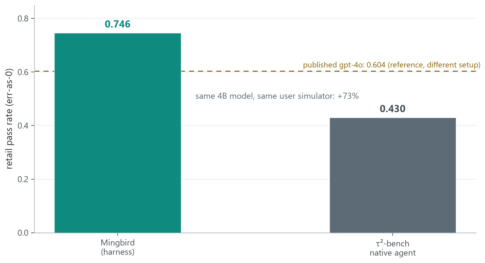

# Benchmarks

Numbers referenced from the [README](../README.md), with methodology and raw data.
Everything here is reproducible on your machine; nothing requires trusting us.

## LRAB-288 (our benchmark)

**Definition.** 4 harnesses × 4 open models × 18 tasks = **288 cells**.

- **Harnesses**: Mingbird, goose, agent-mini, opencode — stock, no patches, each driving the same Ollama backend on the same machine (an integrated GPU, 32 GB shared memory, Windows 11).
- **Models**: `gemma4:e2b` (2B) · `qwen3.5:4b` (4B) · `gemma4:12b` (12B) · `ornith-1.5:35b` (35B, multimodal).
- **Tasks**: 18 real tasks — 15 workflow tasks (WF-01…WF-15: code+tests, data analysis, web research with real search, file organization, refactoring, …) and 3 long-horizon tasks (LH-01…LH-03, multi-hour multi-phase builds).
- **Protocol**: per-cell budget — workflow 90 min, long-horizon 180 min; 1 retry, latest attempt wins; **timeouts score 0**; deterministic artifact-based scoring (files exist, tests actually pass, reports contain the required findings). Every cell runs in a fresh working directory; harness processes are isolated from the scoring.

**Per-model results** (average over 18 tasks; two Mingbird cells are noted below the table):

| Harness | 2B gemma4:e2b | 4B qwen3.5:4b | 12B gemma4:12b | 35B ornith-1.5 | overall |
|---|---|---|---|---|---|
| **Mingbird** | 0.821 | 0.876 | 0.906 | 0.941 | **0.886** |
| goose | 0.271 | 0.801 | 0.772 | 0.679 | 0.631 |
| agent-mini | 0.246 | 0.706 | 0.576 | 0.092 | 0.405 |
| opencode | 0.017 | 0.465 | 0.539 | 0.896 | 0.479 |

On the 3 long-horizon tasks Mingbird leads as well (0.827 vs agent-mini 0.484, goose 0.394, opencode 0.354).

**Quick check**: [reproduce_one.md](reproduce_one.md) — one cell end-to-end in ~30 minutes.

**Raw data**: [`lrab_scores.csv`](lrab_scores.csv) — all 288 cells (harness, task, model, score, wall time, attempt directory). Every number above is the mean of 18 rows of this file.

**Campaigns & notes** (audited post-publication):

- The matrix was collected in three campaigns under one protocol. The baseline arms ran first (Sep 1–4) and were frozen at their stock versions; the Mingbird arm was then re-collected with the final v1.5.0 release code (Sep 13–14) on the same machine, task set, budgets, model tags, and scorer — so every published Mingbird cell reflects the released build. Finally, the goose and opencode arms were re-shot under the unified sampling protocol (Sep 18–20): their stock versions expose no temperature/thinking knobs, so a transport-level proxy pinned every request to temperature 0 + thinking off, binaries untouched (see the sampling note). agent-mini's Sep 1–4 arm already ran at temperature 0 with an explicit `think:false`, so it carries over unchanged. One goose cell (WF-08 at 4B) was excluded after repeated infrastructure failures and is scored 0 (documented in the exclusion log).
- Mingbird's 72 cells: one zero (WF-08 at 35B — a run that completed in 276 s without producing artifacts; the finish gate rejected its completion claims, visible in the published transcript) and one partial (WF-09 at 4B — first attempt timed out, the allowed retry ended in a runner error, scored from its partial artifacts at 0.5 under latest-attempt-wins). Excluding the zero instead of scoring it would raise the 35B column to 0.996; we report 0.941.
- Mingbird ships more default tools than the baselines (persistent memory, skills, batch dispatch). A transcript audit shows zero uses of any of them across the 72 published transcripts.
- Sampling, protocol-pinned: **all four arms run at temperature 0 with thinking off**, so sampling randomness and reasoning-mode drift are not confounds. Mingbird pins both as its released defaults; agent-mini is configured to 0 / `think:false`; goose and opencode expose no such knobs, so their requests pass through a transport-level normalizer (a local proxy setting `temperature=0` and disabling thinking on every request — harness binaries untouched), verified on the wire per model. Left to their defaults, goose and opencode run thinking-on at each model's shipped parameters; those as-released numbers are retained as sensitivity data (thinking moves arms substantially — e.g. opencode 12B 0.140 to 0.539, goose 35B 0.822 to 0.679). Other manifest-level sampling parameters (top_p / top_k / presence_penalty) are untouched by the normalizer and identical across arms.
- goose exposes no context-window knob and runs at its default; the other three harnesses are pinned to 32K. This is the one known configuration asymmetry (see DESIGN.md).

> LRAB was designed by us, so treat it as a *controlled experiment*, not a leaderboard: its value is that everything except the harness is held constant, and that every claim can be recomputed from the CSV.

**Design rationale & statistics**: [DESIGN.md](DESIGN.md) — task ladder, per-task
specifications, scoring architecture, freeze discipline, paired significance
analysis ([SIGNIFICANCE.md](SIGNIFICANCE.md), recomputable via
`analyze_significance.py`), and the threats-to-validity section. Short version
(recomputed on the unified-protocol matrix): Mingbird's edge over all three
competitors is statistically significant on 2B and 12B (Holm-corrected
Wilcoxon, paired by task). At 4B only the opencode comparison separates
(adjusted p=0.018) — goose closes to 0.801 with thinking off (p=0.33), and
agent-mini at its strongest tier stays short of significance (p=0.15). At 35B
goose (p=0.042) and agent-mini (p=0.0005) separate while opencode at 0.896
does not (p=0.47) — we state both directions.

## τ²-bench: three domains under the unified protocol (external)

[τ²-bench](https://github.com/sierra-research/tau2-bench) (Sierra Research) is an independent, published agent benchmark: a user simulator converses with the agent, which must use domain tools (a live domain database) to resolve the request. Scoring checks the final database state and natural-language assertions — an agent that bypasses its tool stream and fakes calls fails the DB check and scores 0, so harnesses cannot fake tool use.

The unified protocol matches the LRAB matrix above, identical for every harness:

- **Agent side**: the same local `qwen3.5:4b` on Ollama, **temperature 0 with thinking off** (transport-pinned for the CLI arms; verified end-to-end — the identical request produces reasoning output when sent directly and none through the pinning proxy).
- **User simulator**: cloud `qwen3.8-flash` for every harness — not the official gpt-4o user setup, so official leaderboard numbers are a different setup and not comparable.
- pass^1, error cells score 0, DB final-state validation included; error cells got up to 2 retry passes.

| Harness | retail (114) | airline (50) | telecom (114) | 3-domain total (278) * |
|---|---|---|---|---|
| **Mingbird** | **0.763** | **0.740** | **1.000** | **0.856** |
| τ² native agent (llm_agent) | 0.675 | 0.740 | 0.930 | 0.791 |
| opencode | 0.588 | 0.500 | 0.991 | 0.737 |

\* derived: per-task average over all 278 tasks, error cells counted as 0; recomputable from the per-trial data below.

Notes:

- retail: the official suite is 115 tasks; 114 run in this environment, scored the same way on all sides.
- The three completed arms finished with **zero error cells** across all 278 tasks.
- The thinking configuration moves arms substantially (opencode telecom 0.298 thinking-on vs 0.991 thinking-off; llm_agent airline 0.520 to 0.740) — itself a harness-level effect; the thinking-on numbers are retained as sensitivity data. Mingbird's own scores move least (retail 0.789 to 0.763).
- goose is deferred: it is slow on this benchmark (40–113 min per task; a token audit shows ~4.85M input tokens per task vs 60–400K for the other arms, driven by nested sub-agent todo/delegation loops), so completing 278 tasks at that throughput is a multi-day run; its unified-protocol re-run is deferred.
- telecom: all 342 cells of the three completed arms finished ok (zero errors) — near-saturated at this model size (1.000 / 0.991 / 0.930); we report it as-is rather than dropping the domain.
- Adapter disclosure: Mingbird's adapter adds two mechanical safeguards on top of the identical prompt and toolset — a repeat-call nudge (one user-role message after 4 identical `(tool, args)` calls) and a parser fallback that recovers format-leaked tool calls into real ones. Both are verbatim in the published adapter source; the native agent receives no injected messages.
- Raw data: per-trial manifests for all three domains are in this repository — [tau2/retail_manifest.json](tau2/retail_manifest.json), [tau2/airline_manifest.json](tau2/airline_manifest.json), [tau2/telecom_manifest.json](tau2/telecom_manifest.json) (each keyed by task, with per-harness status/reward/wall; batch composition documented in [tau2/README.md](tau2/README.md)). The superseded thinking-on legacy batch is archived under [tau2_thinking_on/](tau2_thinking_on/) as sensitivity data only.

## Ablations: which mechanism pays for itself (v1.5.0 code)

**Design.** 4 variants × 18 tasks (the LRAB task set, `gemma4:e2b`), one mechanism disabled per variant via the `AGENT_ABLATION` environment gate; **baseline = the same-code all-mechanisms arm** (n=18, total 0.821). Each variant writes to its own results directory, so resumed runs never cross-contaminate. Per-cell data: [ablation/ablation_scores.csv](ablation/ablation_scores.csv) (5 arms × 18 tasks).

| Variant | total (18 tasks) | Δ vs baseline |
|---|---|---|
| baseline (all mechanisms on) | 0.821 | — |
| − finish_gate | 0.723 | **−0.098** |
| − verify_feedback | 0.772 | −0.048 |
| − anti_loop | 0.805 | −0.015 |
| − flat_prefill | 0.818 | −0.003 |

All four mechanisms are non-negative; the contribution gradient is: prevent-early-finish > verify-feedback loop > anti-loop > prefill (neutral at 2B).

> The 0.821 baseline is not a separate control: it **is** the 2B column of the LRAB-288 table above — the same 18 cells, the same v1.5.0 code. The ablation and the headline results share one batch and one code version.
